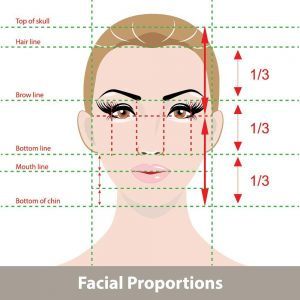
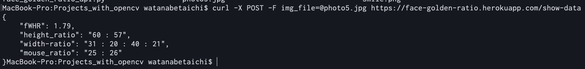

# Face Golden Ratio API
画像に写っている人物の顔を認識し、それぞれの項目に関する黄金比を算出し出力するAPIです。 
APIは[こちら](https://api.rakuten.net/seven0525/api/face-golden-ratio/)に公開されているので自由にお使いください。   
算出するそれぞれの項目に関しては以下の通りです。

## fWHR
fWHR（High facial width-to-height ratio）とは、顔の縦の長さと横幅を比較したもので横幅が大きいほどfWHR値は大きくなります。  
近年の[シンガポールの研究](https://www.sciencedirect.com/science/article/pii/S1090513813000275)や[カナダの研究](https://link.springer.com/article/10.1007/s10508-017-1070-x)では、fWHR値が大きいほどリーダーシップや優位性・支配性，あるいは攻撃性が高いことや，男性ホルモン（テストステロン）が多いことが示されており、こういった印象を与える男性は多くの女性に好まれる傾向があることも判明しています。
（この値が大きい人は経営者や大統領などの政治家に多い）  

一般的な平均は1.6 〜 1.8であり、アメリカの歴代大統領（調べられたのは29人）のfWHRの平均値（中央値も）は1.99となっています。

## Height-Ratio
眉下から鼻下までの距離と、鼻下からあご先までの距離の比率。
この比率が「1:1」に近いほど黄金比に近いです。

## Width-Ratio
顔の幅に対する左右の目の比率。 　
顔の端から左目尻までの距離：左目尻から左目元：左目元から右目目元：右目元から右目尻：右目尻から顔の端、これらの比率。  
この比率が「1:1:1:1:1」に近いほど黄金比に近いです。  

## Mouse-Ratio
鼻下から下唇までの距離と、下唇からあご先までの距離の比率。  
この比率が「1:1」に近いほど黄金比に近いです。




# 技術
 - OpenCV
 - dlib
 - Flask
 - Heroku
 - RakutenRapidAPI

# 実行イメージ（ターミナルから使用する場合）
以下の通りに実行してください。

```
$ curl -X POST -F img_file=@sample.jpg https://face-golden-ratio.herokuapp.com/show-data
```



# 参考
[黄金比 ～美の法則を求めて～ ](http://www.higashi-h.tym.ed.jp/course/kadai23/ougonhi.pdf)   
[PythonでdlibとOpenCVを用いてHelen datasetを学習して顔器官検出](https://qiita.com/kekeho/items/0b2d4ed5192a4c90a0ac)   
[Detect eyes, nose, lips, and jaw with dlib, OpenCV, and Python](https://www.pyimagesearch.com/2017/04/10/detect-eyes-nose-lips-jaw-dlib-opencv-python/)  
